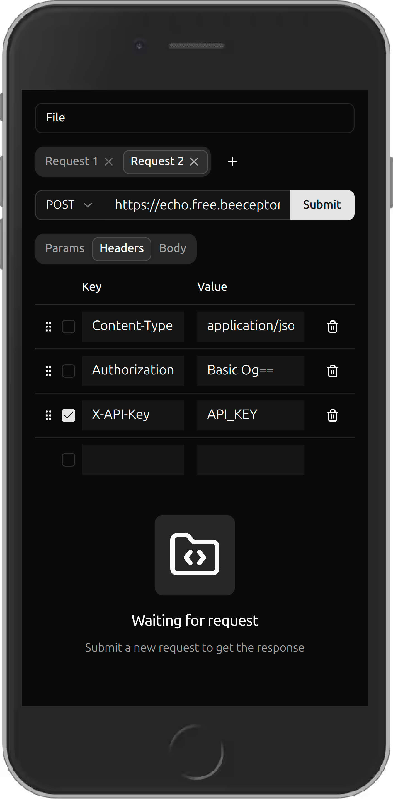
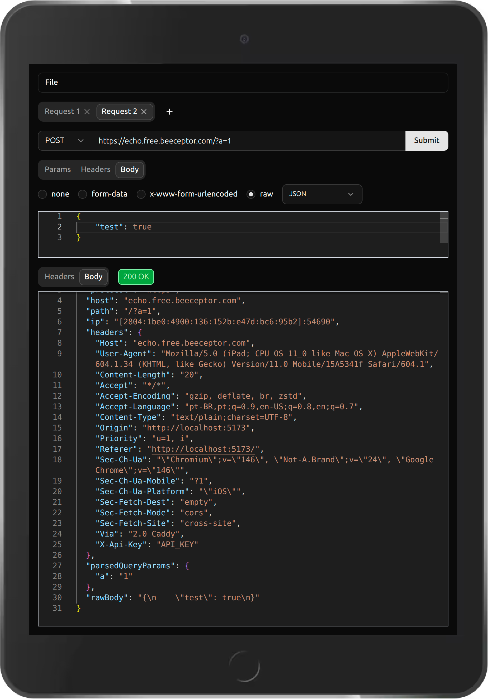

# Freeman

A free, open-source desktop HTTP client — a self-hosted alternative to Postman/Insomnia.

Built with **Vue 3**, **Vite**, **Bun**, and **Tauri** (for desktop builds).

## Showcase

<p align="center">
  
  
</p>

## Features

- Send HTTP requests (GET, POST, PUT, PATCH, DELETE, HEAD, OPTIONS)
- Manage query params, headers, and request body
- Body types: raw (JSON, JavaScript, HTML, XML, Text), form-data, x-www-form-urlencoded
- Import requests from cURL commands
- Multiple request tabs with persistent state
- Response viewer with headers and body (syntax-highlighted)
- Dark/light mode
- Desktop app via Tauri

## Getting Started

```sh
bun install
bun dev
```

## Building

```sh
# Web
bun run build

# Desktop (requires Tauri CLI)
bun run tauri build
```

## Testing

```sh
bun test:unit       # Unit tests (Vitest)
bun test:e2e        # End-to-end tests (Playwright)
bun lint            # Lint
bun run type-check  # Type-check
```

## Contributing

Contributions are welcome. Please open an issue before submitting a pull request for significant changes.

## License

[MIT](./LICENSE)
